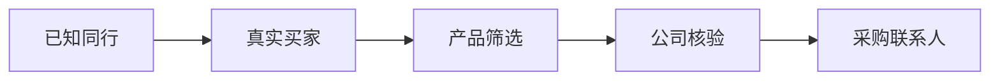

# 顺藤找客

> 从已知同行出发，沿真实贸易记录找到海外买家。

这次项目从7家已知公司出发，扩出218家候选买家。核对产品、公司网站和采购角色后，留下41家值得继续联系。

## 怎么找

先确认几家同行的完整公司名，再反查它们的真实买家。

候选公司会经过三轮核验：

1. 买过什么；
2. 公司实际做什么；
3. 能不能找到合适的采购联系人。

联系人查询放在最后。明显不相关的公司不会继续消耗API费用。

## 一次真实项目

- 7家种子公司；
- 218家候选买家；
- 111家进入目标品类池；
- 41家通过人工与Web核验；
- 26家有直接触达渠道；
- 深挖10家公司，找到50名联系人和10个明确邮箱。

本轮跨境魔方API支出约98元。这是一次项目记录。品类、种子公司和查询深度不同，成本与结果都会变化。

## 为什么从同行出发

直接搜索产品词，结果里常有货代、同行和其他行业。

一次搜索中，`picture frame`返回99条记录，只有32条与相框有关。贸易记录能先确认一家公司是否真实买过相关产品，再决定要不要找联系人。

## 公开版本

仓库保留了种子公司确认、买家扩展、公司去重、产品筛选和线索分档。示例使用合成数据，不包含API密钥、真实客户名单、联系人或原始海关数据。

代码运行与配置见[开发者文档](docs/DEVELOPER.md)。

## License

MIT
