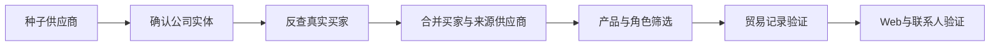

# Trade Lead Snowball

从一组已知供应商出发，沿真实贸易关系向外扩展买家，再用产品、公司角色、交易新鲜度和触达证据筛掉噪音。

数据源适配的是跨境魔方开放API。公开仓库不包含平台密钥、真实客户名单、联系人、邮箱或原始海关数据。

## 为什么做这个

直接搜索产品关键词，往往得到一份很长、也很假的名单。

一次实际项目里，`picture frame`返回的99条记录中，只有32条与相框有关。其余结果包括汽车框架、机械支架和建筑结构。标准化产品字段和HS编码又经常为空。仅靠关键词、HS编码或交易量，都无法判断一家公司是否值得开发。

后来采用了另一条路径：



公司库负责发现，贸易记录负责验证。Web Search用来识别网站、主营业务和采购决策人。付费联系人接口只在候选对象已经足够确定时调用。

## 一次匿名交付

下面的数字来自一次真实交付，企业身份已经移除：

- 从7家种子供应商出发；
- 去重后形成218个候选买家；
- 111个候选进入目标品类池；
- 人工与Web验证后保留41个有效客户；
- 其中26个具有LinkedIn或其他直接触达渠道；
- 对10家公司进一步查询50名联系人，获得10个明确邮箱；
- 当日API成本约98元。

这些数字不随仓库提供可复现数据。它们说明方法来自实际项目，不代表任何用户都能获得相同结果。

## 沉淀下来的行业规则

1. **产品描述会跨行业撞词。** `frame`同时指相框、车架、结构框和支架。判断必须组合正向词、排除词和原始货描。
2. **Seller不一定是工厂。** 提单中的卖方可能是货代或贸易公司，需要再看公司主营、交易对手与公开网站。
3. **HS编码不能独立承担判断。** 细分产品可能没有稳定编码，平台里的归一化字段也可能为空。
4. **公司全名比简称可靠。** 先通过企业库确认实体，再用完整名称反查买家，能显著减少同名噪音。
5. **发现和验证应使用不同工具。** 企业库适合扩展候选；贸易记录、网站和联系人证据适合确认。
6. **联系人查询应放在最后。** 先验证企业和产品，避免为错误对象支付API费用。

## 仓库做了什么

公开版本包含：

- 跨境魔方API适配器；
- 种子企业实体确认；
- 从供应商向买家的分页扩展；
- 公司实体标准化与去重；
- 产品正向词和排除词规则；
- 交易量、交易新鲜度、联系方式和多种子交叉验证评分；
- `qualified / review / rejected`三档结果；
- JSON、CSV和Markdown报告；
- 不调用真实API的合成数据重放模式。

它没有自动获取具体联系人，也不会替代人工尽调。有效线索仍需检查公司网站、业务身份和采购角色。

## 快速开始

不产生API费用，直接重放合成数据：

```bash
git clone https://github.com/raychen-sjtu/trade-lead-snowball.git
cd trade-lead-snowball

python3 -m venv .venv
source .venv/bin/activate
pip install -r requirements.txt

python trade_snowball.py replay \
  --config examples/config.demo.json \
  --trace examples/replay_trace.json \
  --output-dir outputs/demo
```

输出包括：

- `leads.csv`
- `summary.json`
- `api_trace.json`
- `report.md`

## 使用跨境魔方API

先在环境变量中设置凭证：

```bash
export TRADE_API_KEY="..."
export TRADE_API_BASE="https://openapi.upkuajing.com"

python trade_snowball.py run \
  --config examples/config.demo.json \
  --output-dir outputs/live
```

公开版本使用两个接口：

- `/search/company/list`：确认种子公司的完整实体；
- `/customs/company/list`：按已确认的供应商反查买家。

接口字段、价格和权限可能变化，请以自己的跨境魔方账号文档为准。

## 配置

配置文件中最重要的是：

- `seeds`：已知供应商及候选全名；
- `include_keywords`：目标产品的真实贸易语言；
- `exclude_keywords`：容易撞词的错误行业；
- `buyer_countries`：目标市场；
- `max_pages_per_seed`：单个种子的扩展上限；
- `qualified_threshold`和`review_threshold`：分档阈值。

真实项目不要把企业内部简称直接当作产品词。优先使用提单、产品页和采购方实际出现的语言。

## 结果解释

评分用于排序和初筛。它不是客户成交概率。

`qualified`仍需人工确认：

- 企业是真实买家、经销商还是货代；
- 产品与当前销售方向是否一致；
- 最近交易是否仍有业务意义；
- 联系人是不是采购决策人；
- 公开证据能否支持结论。

## 隐私

不要提交：

- `.env`与API Key；
- 未经授权的客户、买家、供应商名单；
- 邮箱、电话、WhatsApp和个人社媒；
- 原始海关记录与付费API完整响应；
- 能够反推出委托方身份的种子企业组合。

## License

MIT

