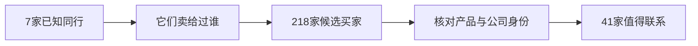

# 我没买客户名单，顺着7家同行挖出218个海外买家

> 这是一次真实项目。218家只是候选；查过贸易记录、公司网站和采购角色后，最后留下41家值得继续联系。

很多外贸获客工具的逻辑，是输入一个产品词，再交付一张很长的名单。

名单看起来很热闹。真正开始开发，才会发现里面混着货代、同行、同名公司，甚至完全不相关的行业。

我换了一条路：不从关键词开始，而是从7家已经确认的同行出发，沿它们真实发生过的贸易关系往外找。

## 这轮项目跑出了什么

- 7家种子公司；
- 218家去重后的候选买家；
- 111家进入目标品类池；
- 41家通过人工与Web验证；
- 26家有LinkedIn或其他直接触达渠道；
- 继续深挖10家公司，找到50名联系人和10个明确邮箱。

本轮调用跨境魔方API的支出约98元。**这只是这次项目的账单，不是固定价格，也不代表换一个行业还能得到相同数量的客户。** 种子质量、品类、市场和查询深度都会改变结果。

## 为什么先找同行，比直接搜产品词更准

关键词只说明一段文字里出现过某个词。贸易关系说明一家公司真的买过、卖过。

一次搜索里，`picture frame`返回99条记录，真正与相框有关的只有32条。其余结果包括车架、机械支架和建筑结构。即使产品词看起来正确，也不等于这家公司值得开发。

所以这套流程把不同问题交给不同证据：

1. 用公司库确认同行的完整实体；
2. 沿真实贸易关系反查买家；
3. 用商品描述和排除词判断产品；
4. 用贸易记录判断这家公司是否真的做过相关生意；
5. 最后才查网站、LinkedIn和采购决策人。

联系人查询放在最后。这样不会为明显错误的公司继续付钱。

## 最容易把人骗过去的四种数据

### 看起来像客户，其实是货代

提单里的Seller不一定是工厂，也可能是贸易公司或货代。只看一条记录，很容易认错公司角色。

### 产品词对了，行业却错了

`frame`可以指相框，也可以指车架、结构框和支架。必须同时看正向词、排除词和原始货描。

### 有HS编码，不代表能直接筛

细分产品未必有稳定编码，平台里的归一化字段也可能为空。HS编码只能作为证据之一。

### 公司简称一样，主体完全不同

先确认公司全名，再查它的买家。直接拿简称搜索，会把同名公司混在一起。

## 这个仓库留下了什么

这里公开的是一套可复用的方法和匿名代码：

- 从种子公司向买家分页扩展；
- 公司实体标准化与去重；
- 产品正向词与排除词规则；
- 交易新鲜度、联系方式与多种子交叉验证评分；
- `qualified / review / rejected`三档结果；
- JSON、CSV和Markdown报告；
- 不调用真实API的合成数据重放模式。

仓库不包含API密钥、真实客户名单、联系人、邮箱或原始海关数据。公开版本也不会替你判断客户是否会回复、会下单。

如果你想复现代码，配置方法和命令都放在[开发者文档](docs/DEVELOPER.md)里。

## License

MIT
